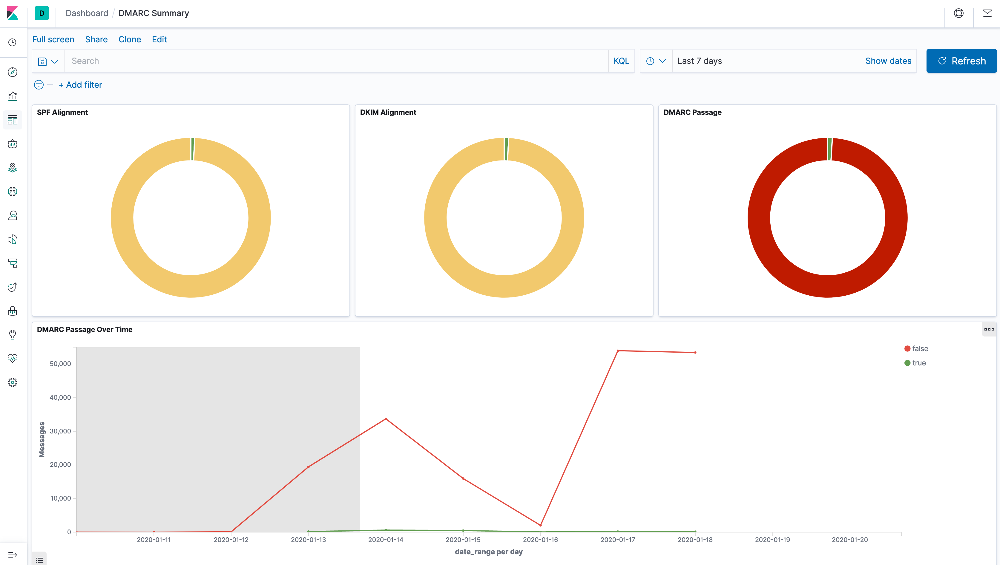

# :e-mail: parsedmarc

This repo is based of off https://github.com/dragoangel/parsedmarc-dockerized.

## :information_source: Info

This stack includes:

- [ParseDMARC](https://domainaware.github.io/parsedmarc/)
- [Elasticsearch & Kibana](https://www.elastic.co/guide/index.html) to store and visualize parsed data

## :gear: How-to deploy from scratch

1. Install [Docker](https://docs.docker.com/install/) and [Docker Compose](https://docs.docker.com/compose/install/).
2. Allow IMAP access to reports@prodeko.org in gmail settings. Also allow less secure apps access from the accounts settings.
3. Run `ansible-playbook playbook.yml --extra-vars '@passwd.yml' --tags parsedmarc` from Prodeko's [infrastructure repo](https://github.com/Prodeko/infrastructure).

4. Download & Import [kibana_saved_objects.ndjson](https://raw.githubusercontent.com/domainaware/parsedmarc/master/kibana/export.ndjson).

Go to `https://dmarc.prodeko.org/app/kibana#/management/kibana/objects?_g=()` click on `Import`.

Import downloaded kibana_saved_objects.ndjson with override.

## Elasticsearch issues

If you are not seeing recent updates in the Kibana dasboard try the following useful commands to debug cluster health and shard allocation issues:

```
# Run from kibana container
$ curl -XGET 'http://elasticsearch:9200/_cluster/health?pretty'

# Source: https://www.datadoghq.com/blog/elasticsearch-unassigned-shards/
# Understand shard allocation issues
$ curl -XGET 'http://elasticsearch:9200/_cluster/allocation/explain?pretty'

# Delete all shards
# WARNING: you should restart the container group in order to create the indices again
$ curl -XDELETE http://elasticsearch:9200/_all

# The following command was used to set the 'number_of_replicas' setting on all existing indices to 0
$ curl -XPUT "http://elasticsearch:9200/_template/default_template" -H 'Content-Type: application/json' -d'
{
  "index_patterns": ["*"],
  "settings": {
    "number_of_replicas": 0
  }
}
'
```

## Dashboard Sample


